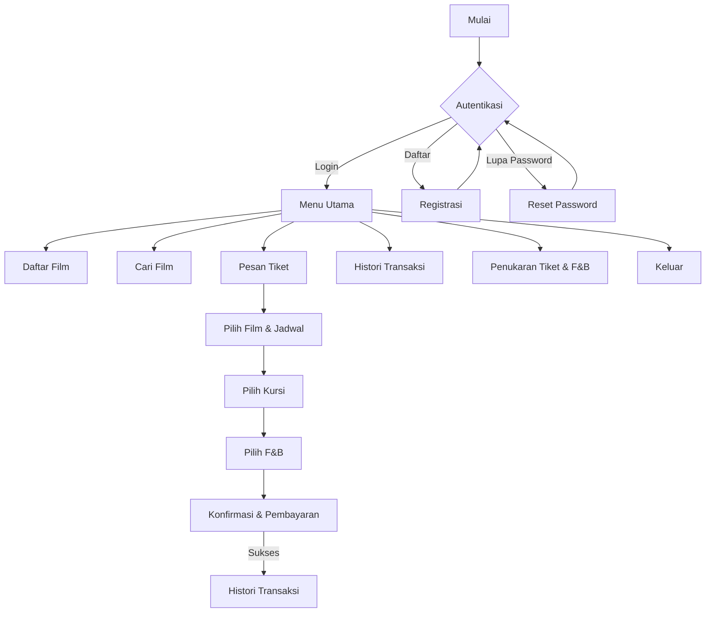

# Dokumentasi Proyek MOVTIX

---

## 1. Ringkasan Aplikasi

**MOVTIX** adalah aplikasi layanan pemesanan tiket bioskop digital yang dirancang untuk memberikan pengalaman efisien, aman, dan mudah bagi pengguna. Fitur utama meliputi pencarian dan pemesanan tiket film, pemilihan kursi sesuai kapasitas studio, layanan makanan dan minuman (F&B), serta pengelolaan transaksi dan penukaran tiket secara digital. MOVTIX juga menerapkan sistem antrian pada kursi dan penukaran, serta memuat validasi di setiap tahap untuk menjamin keamanan dan kenyamanan pengguna.

---

## 2. Flowchart Umum MOVTIX



---

## 3. Tampilan & Alur MOVTIX

### 3.1 Autentikasi Pengguna

#### **Menu Awal Autentikasi**

```text
============================ MOVTIX BIOSKOP ============================

Selamat datang di MOVTIX!
Pilih salah satu opsi berikut:

1. Login
2. Daftar Akun Baru
3. Lupa Password
4. Keluar

Silakan masukkan pilihan [1-4]:
```

#### **A. Login**

```text
------------------------- LOGIN MOVTIX --------------------------

Masukkan Username : [..........]
Masukkan Password : [..........]

[Login berhasil! Selamat datang, {NAMA_USER}.]

Jika gagal:
[Login gagal. Silakan periksa username dan password Anda.]
```

#### **B. Daftar Akun**

```text
--------------------- PENDAFTARAN AKUN BARU ---------------------

Nama Lengkap      : [..........]
Username          : [..........]
Email             : [..........]
Password          : [..........]
Konfirmasi Pass   : [..........]

[Registrasi berhasil! Silakan login untuk melanjutkan.]
```

#### **C. Lupa Password**

```text
----------------------- RESET PASSWORD --------------------------

Masukkan username/email Anda : [..........]

[Kode verifikasi telah dikirim ke email Anda.]
Masukkan kode verifikasi    : [......]
Masukkan password baru      : [..........]
Konfirmasi password baru    : [..........]

[Password berhasil diubah. Silakan login.]
```

---

### 3.2 Menu Utama

```text
========================= MENU UTAMA MOVTIX =========================

1. Daftar Film Sedang Tayang
2. Cari Film
3. Pesan Tiket
4. Histori Transaksi
5. Penukaran Tiket & F&B
6. Keluar / Logout

Masukkan pilihan [1-6]:
```

---

### 3.3 Daftar Film Sedang Tayang

```text
==================== DAFTAR FILM SEDANG TAYANG ====================

| No | Judul                  | Genre     | Durasi | Rating | Jadwal Tayang               | Popularitas |
|----|------------------------|-----------|--------|--------|-----------------------------|-------------|
| 1  | Deadpool & Wolverine   | Action    | 2j10m  | D17+   | 12:00, 15:00, 18:15         | 1.250 tiket |
| 2  | Inside Out 2           | Animation | 1j40m  | SU     | 09:00, 11:00, 13:15, 15:30  | 1.050 tiket |
| 3  | Interstellar           | Sci-Fi    | 2j49m  | SU     | 10:00, 13:15, 16:30         |   980 tiket |
| 4  | Kung Fu Panda 4        | Animation | 1j34m  | SU     | 17:45, 19:45, 20:30         |   900 tiket |

[Tips: Tekan S untuk sortir, ketik nomor film untuk detail, 0 untuk kembali]
```

---

### 3.4 Cari Film

```text
------------------------ CARI FILM MOVTIX ------------------------

Masukkan kata kunci judul/genre: [..........]

Hasil pencarian:
| No | Judul               | Genre     | Jadwal              |
|----|---------------------|-----------|---------------------|
| 1  | Interstellar        | Sci-Fi    | 10:00, 13:15, 16:30 |
| 2  | Inside Out 2        | Animation | 09:00, 11:00, 13:15 |

[Pilih nomor film untuk detail, atau 0 untuk kembali]
```

---

### 3.5 Pemesanan Tiket (Alur Lengkap)

#### **A. Pilih Film & Jadwal**

```text
-------------------- DETAIL FILM & JADWAL TAYANG --------------------

Judul   : Interstellar
Genre   : Sci-Fi
Durasi  : 2j49m
Rating  : SU

| No | Waktu  | Audi | Kapasitas |
|----|--------|------|-----------|
| 1  | 10:00  | 1    | 80        |
| 2  | 13:15  | 1    | 80        |
| 3  | 16:30  | 1    | 80        |

Pilih jadwal tayang [1-3, 0 untuk batal]:
```

**Validasi:**

- Hanya jadwal tersedia yang dapat dipilih.

#### **B. Pilih Kursi**

```text
----------------------- PILIH KURSI - AUDI 1 (80 Kursi) -----------------------

Layar
─────────────────────────────────────────────

    1   2   3   4   5   6   7   8   9   10
A  🟩  🟩  🟩  🟩  🟩  🟩  🟩  🟩  🟩  🟩
B  🟩  🟩  ❌  🟩  🟩  🟩  🟩  🟩  🟩  🟩
C  🟩  🟩  🟩  🟩  🟩  🟩  🟩  🟩  🟩  🟩
...

🟩: Tersedia   ❌: Terisi/Pending

Pilih kursi (misal: B2,B3): [..........]

**Validasi Kursi:**
- Tidak boleh melebihi kapasitas audi.
- Tidak boleh memilih kursi yang sudah terisi/pending.
- Maksimal pembelian per transaksi: 6 kursi.
- Jika input tidak valid:
  [Kursi tidak tersedia/sudah dibeli. Silakan pilih kursi lain.]
```

#### **C. Pilih F&B**

```text
---------------------- PILIH MAKANAN & MINUMAN ----------------------

| No | Nama                | Harga   |
|----|---------------------|---------|
| 1  | Popcorn Large       | 25.000  |
| 2  | Popcorn Medium      | 18.000  |
| 3  | Soft Drink          | 10.000  |
| 4  | Mineral Water       |  8.000  |
| 5  | Tidak pesan                  |

Pilih nomor F&B (pisahkan koma, atau 5 untuk skip): 1,3
```

#### **D. Konfirmasi & Pembayaran**

```text
--------------------- KONFIRMASI PESANAN ---------------------

Nama            : [Nama User]
Film            : Interstellar
Tanggal & Jam   : 01-07-2025 13:15
Audi            : 1
Kursi           : B2, B3
F&B             : Popcorn Large, Soft Drink
Subtotal Tiket  : 2 x 50.000 = 100.000
Subtotal F&B    : 25.000 + 10.000 = 35.000
Biaya Admin     : 5.000
Total           : 140.000

Pilih metode pembayaran:
1. Transfer Bank
2. Kartu Kredit/Debit
3. Poin MOVTIX
0. Batalkan

Input pilihan [0-3]: 2

[Proses pembayaran...]
[Transaksi berhasil!]

Kode Booking   : IN748392
Passkey        : 910374

Simpan kode booking & passkey untuk masuk studio dan klaim F&B.
```

**Validasi:**

- Jika saldo/pembayaran gagal, tampilkan alasan dan batalkan transaksi.
- Jika user menunda pembayaran, status transaksi jadi “UNPAID”, kursi di-lock 15 menit, lalu expired.

---

### 3.6 Histori Transaksi

```text
====================== HISTORI TRANSAKSI MOVTIX ======================

| No | Tanggal   | Film         | Jadwal | Audi | Kursi   | Status   | Total    |
|----|-----------|--------------|--------|------|---------|----------|----------|
| 1  | 01-07-25  | Interstellar | 13:15  | 1    | B2,B3   | PAID     | 140.000  |
| 2  | 02-07-25  | Deadpool     | 18:15  | 2    | C4      | UNPAID   |  65.000  |
| 3  | 02-07-25  | Inside Out 2 | 11:00  | 3    | A1      | EXPIRED  |  55.000  |

[Pilih nomor transaksi untuk detail/pembayaran ulang (jika UNPAID), atau 0 untuk kembali]
```

---

### 3.7 Penukaran Tiket & F&B

```text
---------------------- PENUKARAN TIKET & F&B ----------------------

Silakan masukkan kode booking: [..........]
Masukkan passkey: [..........]

[Validasi kode...]

Jika valid:
[Penukaran tiket & F&B berhasil! Selamat menonton.]

Jika tidak valid:
[Kode booking atau passkey salah / sudah digunakan.]
```

---

## 4. Test Case & Validasi

### Test Case 1: Registrasi & Login Sukses

- Input data valid pada pendaftaran, berhasil login.

### Test Case 2: Login Gagal (Password Salah)

- Input username benar, password salah.
- Output: “Login gagal. Silakan periksa username dan password Anda.”

### Test Case 3: Lupa Password

- Input email terdaftar, sistem kirim kode OTP, berhasil reset.

### Test Case 4: Pesan Tiket (Flow Normal)

- Pilih film & jadwal valid, pilih kursi tersedia, pilih F&B, pembayaran sukses.
- Status transaksi: PAID, kursi berubah menjadi tidak tersedia.

### Test Case 5: Pesan Tiket, Kursi Sudah Terisi

- Pilih kursi yang sudah diambil user lain.
- Output: “Kursi tidak tersedia/sudah dibeli. Silakan pilih kursi lain.”

### Test Case 6: Pembayaran Pending/Expired

- User tidak menyelesaikan pembayaran dalam 15 menit.
- Status transaksi menjadi EXPIRED, kursi dilepas otomatis.

### Test Case 7: Penukaran Tiket Berhasil

- Masukkan kode booking & passkey benar.
- Output: “Penukaran tiket & F&B berhasil! Selamat menonton.”

### Test Case 8: Penukaran Tiket Gagal

- Input kode booking/passkey salah atau sudah digunakan.
- Output: “Kode booking atau passkey salah / sudah digunakan.”

---

## 5. Validasi & Aturan Penting

- **Autentikasi**: Username, email, dan password wajib valid dan unik.
- **Daftar Film & Jadwal**: Hanya tampilkan film yang sedang tayang, jadwal tidak boleh bentrok.
- **Kapasitas Kursi**: Pemilihan kursi tidak boleh melebihi kapasitas audi.
- **Kursi Pending**: Kursi yang dipilih user lain dan belum dibayar tetap di-lock sampai expired.
- **Metode Pembayaran**: Validasi saldo, kartu, atau poin MOVTIX.
- **Transaksi**: Status hanya bisa PAID, UNPAID (pending), atau EXPIRED.
- **Penukaran Tiket**: Validasi kode booking & passkey; hanya bisa digunakan sekali.

---

## 6. Penutup & Saran Pengembangan

Aplikasi MOVTIX telah memenuhi aspek utama sistem tiket bioskop modern, dengan proses user-friendly, validasi ketat di setiap tahap, serta laporan dan histori yang jelas.  
Saran pengembangan: integrasi notifikasi, pembayaran digital lebih banyak, serta fitur promo & membership.

---

**Catatan:**

- Semua teks, output, dan tabel dapat disesuaikan lebih lanjut sesuai kebutuhan UI/UX pada implementasi C++ atau platform lain.
